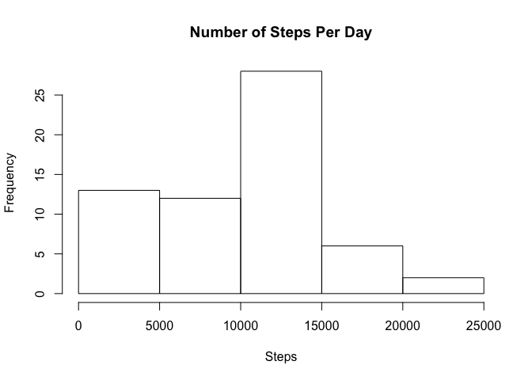
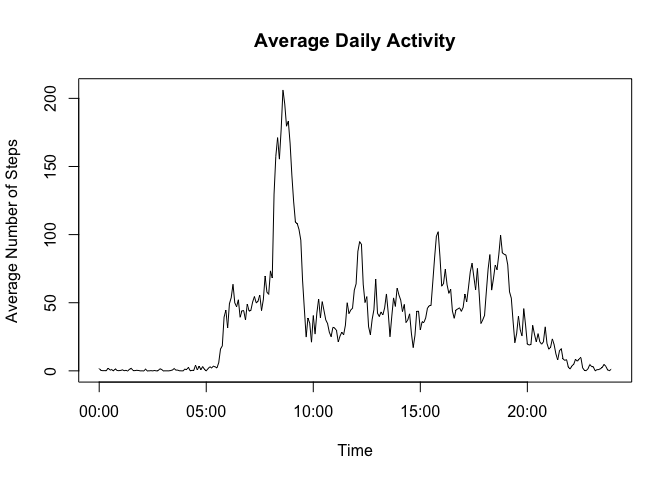
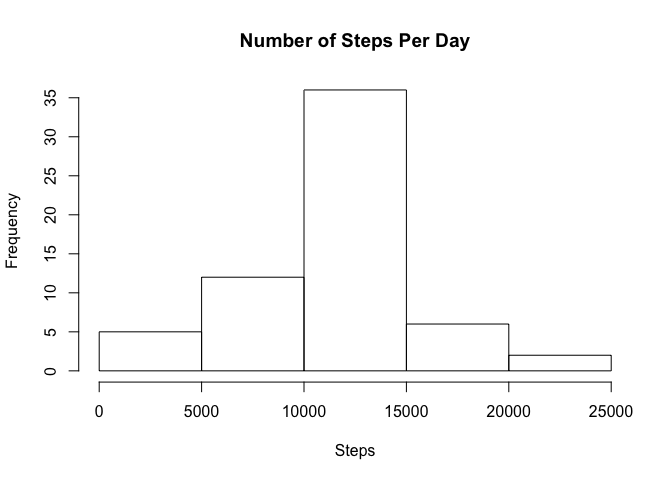
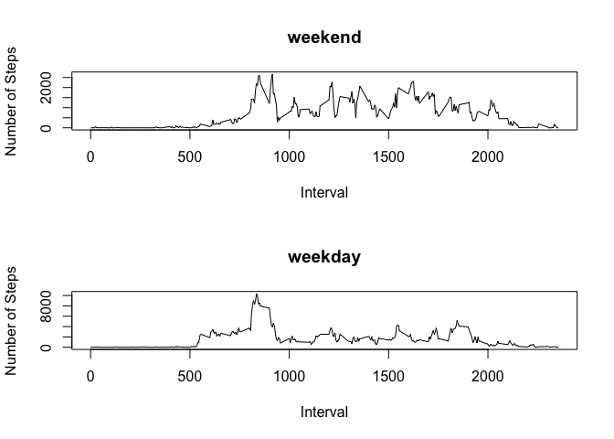

In this document you can find the code and answers to the questions for Assessment 1.

## Loading and preprocessing the data

The first step is to read the database that was already unzipped in the working directory.
Then, modify the intervals to time format so they can be analized as time variable.


```r
data <- read.csv("activity.csv")
uni <- nchar(data$interval) == 1
dec <- nchar(data$interval) == 2
cen <- nchar(data$interval) == 3
data$interval[uni] <- paste0("000", data$interval[uni])
data$interval[dec] <- paste0("00", data$interval[dec])
data$interval[cen] <- paste0("0", data$interval[cen])
library(dplyr)
```

```
## 
## Attaching package: 'dplyr'
```

```
## The following objects are masked from 'package:stats':
## 
##     filter, lag
```

```
## The following objects are masked from 'package:base':
## 
##     intersect, setdiff, setequal, union
```

## What is mean total number of steps taken per day?

To calculate the number of steps per day, use tapply to apply the sum function on the steps for each day.


```r
sums <- tapply(data$steps, data$date, sum, na.rm = TRUE)
```

Then, create a histogram with the calculated vector.


```r
hist(sums, main = "Number of Steps Per Day", xlab = "Steps")
```

<!-- -->

With that same vector we can calcultate the mean and median of the total steps per day.


```r
a <- mean(sums)
m <- median(sums)
```

The **mean** number of daily steps is **9354.2295082**.  
The **median** number of daily steps is **10395**.

## What is the average daily activity pattern?

Calculate the average number of steps for each time interval by applying the mean function to the steps counted on each interval over all the days. Then, convert the interval into time class so the time series can be plotted.


```r
ave <- tapply(data$steps, data$interval, mean, na.rm = TRUE)
y <- strptime(names(ave), "%H%M")
```

Plot the results from the previous step.


```r
plot(y, ave, type = "l",
     main = "Average Daily Activity",
     xlab = "Time",
     ylab = "Average Number of Steps")
```

<!-- -->

Find the interval that has the maximum number of steps.


```r
m <- as.numeric(names(ave[ave == max(ave)]))
```

The 5-minute interval that on average has the maximum number of steps is **835**.

## Imputing missing values

First, we calculate the total number of NA's in the database.


```r
n <- sum(is.na(data$steps))
```

The total number of rows with NA values is **2304**.

Because there are days that have all intervals with NA values, is not possible to fill them with the average for the day. For this reason, is better to replace each NA value with the rounded value of the average for its 5-minute interval.

To keep the original data base separated, we create a new data base "no_na" with the NA values already replaced.


```r
no_na <- data
bad <- is.na(no_na$steps)
for(i in 1:n) {
  x <- names(ave) == no_na[bad,][i,3]
  no_na[bad,][i,1] <- round(ave[x])
}
```

As in previous steps, we use tapply to calculate the total number of steps per day and plot it on a histogram. Then, we calculate the mean and median for the total number of steps per day.


```r
sums <- tapply(no_na$steps, no_na$date, sum, na.rm = TRUE)
hist(sums, main = "Number of Steps Per Day", xlab = "Steps")
```

<!-- -->

```r
a <- as.character(round(mean(sums), digits = 2))
m <- as.character(round(median(sums), digits = 2))
```

The **mean** number of daily steps is **10765.64**.  
The **median** number of daily steps is **10762**.

As we can see, when we plotted the data without NA's, a normal distribution was not as clear as when we plotted the replaced values for the NA's.  
Also, the median and mean values for the replaced data are close. Different from the values for the data that omitted the NA's, which had around thosund difference between mean and median.

## Are there differences in activity patterns between weekdays and weekends?

The code below calculates if the day is a weekday or a weekend.


```r
no_na$type <- "weekday"
no_na$date <- as.Date(no_na$date)
weekend <- grep("S", weekdays(no_na$date))
no_na$type[weekend] <- "weekend"
```

Using dplyr package we calculate the total number of steps per 5-minute interval for weekdays and weekends. Then, we plot the time series and total number of steps comparing between weekdays and weekends.


```r
library(dplyr)
y <- no_na %>% group_by(type, interval) %>% summarize(steps = sum(steps))
```

```
## `summarise()` regrouping output by 'type' (override with `.groups` argument)
```

Weekday and weekend comparisson plot.


```r
par(mfrow = c(2,1))
with(subset(y, type == "weekend"), 
     plot(interval, steps, type = "l", 
     ylab = "Number of Steps", 
     xlab = "Interval",
     main = "weekend"))
with(subset(y, type == "weekday"), 
     plot(interval, steps, type = "l", 
     ylab = "Number of Steps", 
     xlab = "Interval",
     main = "weekday"))
```

<!-- -->
